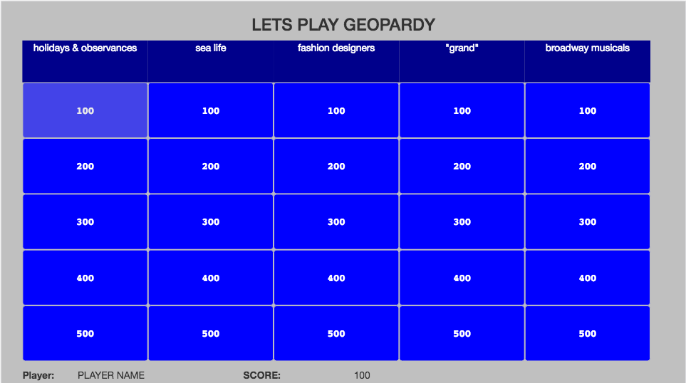

# Project Title
GEOPARDY

## App Summary

My project is a trivia app based on Jeopardy. I call it Geopardy! The app generates random categories and questions. The user can select a difficulty level of question with a corresponding point value from the board. The user must answer the question and will be awarded the points accordingly. All feedback has been good, though there are some bugs still. I got to the point that the app is at by following my user stories and prioritizing the features I really wanted to get working.

## Demo

[Link](https://www.youtube.com/watch?v=v0HuBF0PZ3U)

## Getting Started

Follow the directions given in the app!

### Prerequisites

I suggest using Chrome as a browser, however most will work. If you're using IE please stop.

## Deployment

https://q1-project-9dbeb.firebaseapp.com/

## Built With

* [jQuery](https://jquery.com/) - The javascript library used.
* [Bootstrap3](http://getbootstrap.com/) - The framework used.

## Authors

* **Casey Herold** - *Initial work* - [KCN8](https://github.com/KCN8)

## License

Everything used to develop this is open source and use for others is the same!
